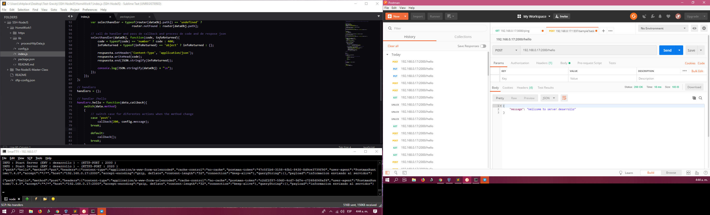

# Homework Assignment #1 - **Nodejs Master Class**

1. RESTful API that listen on a port desarrollo(2000 and 2020) and produccion(3000 and 3001).
2. When someone posts anyting to the route `/hello`, you should return a welcome message in **JSON** format. 

